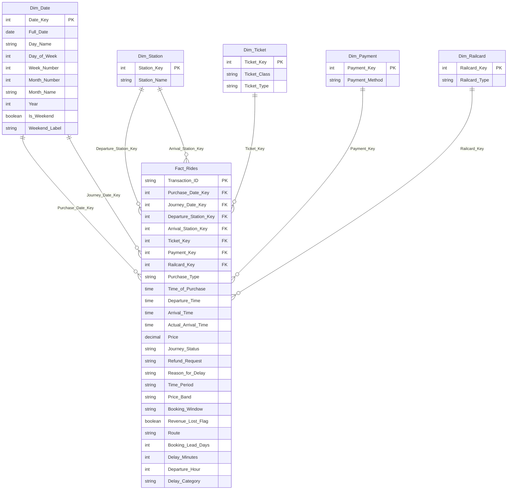

# 🏗️ دليل بناء الـ Data Model في Power BI — Star Schema

> **المشروع:** UK Train Rides Analysis  
> **الأعمدة:** 18 أصلي + 9 ميزات (F10–F18)  
> **النموذج:** Star Schema (نجمة)

---

## 📌 لماذا Star Schema؟

الـ Star Schema هو **أفضل نموذج** لـ Power BI للأسباب التالية:

| الميزة | الشرح |
|--------|------|
| ⚡ **أداء أسرع** | DAX Engine يعمل بكفاءة أعلى بكثير مع Star Schema لأنه مبني على نظام VertipaqStorage الذي يضغط الـ Dimension Tables بشكل ممتاز |
| 🧭 **سهولة التصفية** | كل Slicer يعمل في اتجاه واحد (One-to-Many) من الـ Dimension إلى الـ Fact — لا توجد علاقات دائرية (Circular Relationships) |
| 📊 **بساطة الـ DAX** | لا تحتاج لدوال معقدة مثل `USERELATIONSHIP` أو `CROSSFILTER` لأن العلاقات واضحة |
| 🔄 **قابل للتوسع** | لو أضفت بيانات أشهر جديدة (مايو، يونيو)، فقط تُحدّث الـ Fact Table |

---

## 🧩 هيكل النموذج — الجداول المطلوبة

النموذج يتكون من **1 جدول حقائق (Fact Table)** + **5 جداول أبعاد (Dimension Tables)**:



---

## 📋 تفصيل كل جدول

### 1️⃣ Fact_Rides — جدول الحقائق (الجدول المركزي)

هذا هو الجدول الأكبر (31,653 صف). يحتوي على **القياسات** (Measures) و **المفاتيح الخارجية** (Foreign Keys) التي تربطه بالأبعاد.

| العمود | المصدر | النوع | الدور |
|--------|--------|------|------|
| `Transaction_ID` | أصلي | Text | 🔑 Primary Key |
| `Purchase_Date_Key` | مشتق من `Date of Purchase` | Integer | 🔗 FK → Dim_Date |
| `Journey_Date_Key` | مشتق من `Date of Journey` | Integer | 🔗 FK → Dim_Date |
| `Departure_Station_Key` | مشتق من `Departure Station` | Integer | 🔗 FK → Dim_Station |
| `Arrival_Station_Key` | مشتق من `Arrival Destination` | Integer | 🔗 FK → Dim_Station |
| `Ticket_Key` | مشتق من `Ticket Class` + `Ticket Type` | Integer | 🔗 FK → Dim_Ticket |
| `Payment_Key` | مشتق من `Payment Method` | Integer | 🔗 FK → Dim_Payment |
| `Railcard_Key` | مشتق من `Railcard` | Integer | 🔗 FK → Dim_Railcard |
| `Purchase_Type` | أصلي | Text | قيمتان فقط — ليس بحاجة لجدول منفصل |
| `Time_of_Purchase` | أصلي | Time | وقت الشراء |
| `Departure_Time` | أصلي | Time | وقت المغادرة المجدول |
| `Arrival_Time` | أصلي | Time | وقت الوصول المجدول |
| `Actual_Arrival_Time` | أصلي | Time | وقت الوصول الفعلي |
| `Price` | أصلي | Decimal | 💰 **المقياس الرئيسي** — سعر التذكرة (£) |
| `Journey_Status` | أصلي | Text | حالة الرحلة (On Time / Delayed / Cancelled) |
| `Refund_Request` | أصلي | Text | هل طُلب استرداد؟ (Yes / No) |
| `Reason_for_Delay` | أصلي | Text | سبب التأخير أو الإلغاء (Weather, Signal Failure, etc.) |
| `Time_Period` | ✨ **ميزة F10** | Text | فترة اليوم (Morning Peak / Midday / Evening Peak / Off-Peak) |
| `Price_Band` | ✨ **ميزة F11** | Text | الفئة السعرية (Budget / Standard / Premium / Luxury) |
| `Booking_Window` | ✨ **ميزة F12** | Text | نافذة الحجز (Same Day / Short / Medium / Long / Very Long) |
| `Revenue_Lost_Flag` | ✨ **ميزة F13** | Boolean | علامة خسارة الإيرادات (True = ملغاة + مُستردة) |
| `Route` | ✨ **ميزة جديدة F14** | Text | المسار: Departure → Arrival (أهم بُعد تحليلي — Top Routes, Treemap) |
| `Booking_Lead_Days` | ✨ **ميزة جديدة F15** | Integer | أيام بين تاريخ الشراء وتاريخ الرحلة (رقمي، بحد أدنى 0) |
| `Delay_Minutes` | ✨ **ميزة جديدة F16** | Integer | دقائق التأخير للرحلات المتأخرة (مع معالجة عبور منتصف الليل) |
| `Departure_Hour` | ✨ **ميزة جديدة F17** | Integer | ساعة المغادرة 0–23 (تحليل ذروة بالساعة) |
| `Delay_Category` | ✨ **ميزة جديدة F18** | Text | تصنيف التأخير: On Time / Minor (≤15 دقيقة) / Major (>15 دقيقة) |

> [!IMPORTANT]
> جميع الميزات التسع (F10–F18) تبقى **داخل جدول الـ Fact** كـ Calculated Columns وليس كجداول منفصلة، وذلك لأنها:
> - مشتقة من أعمدة أخرى موجودة في نفس الجدول
> - لا تحتاج لترتيب مخصص (Custom Sort) معقد
> - عدد قيمها الفريدة صغير (4–65 قيمة لكل عمود)
> 
> هذا يُبسّط النموذج بدون التأثير على الأداء.

---

### 2️⃣ Dim_Date — جدول التاريخ (⭐ الأهم)

> [!TIP]
> هذا هو الجدول الأهم في أي نموذج Power BI. يجب أن يكون **جدولاً واحداً** يخدم تاريخين مختلفين: تاريخ الشراء وتاريخ الرحلة — عبر علاقتين (Active + Inactive).

| العمود | النوع | مثال | الشرح |
|--------|------|-------|------|
| `Date_Key` | Integer | `20240115` | 🔑 PK بصيغة YYYYMMDD |
| `Full_Date` | Date | `2024-01-15` | التاريخ الكامل |
| `Day_Name` | Text | `Monday` | اسم اليوم |
| `Day_of_Week` | Integer | `1` | رقم اليوم (1=Mon … 7=Sun) |
| `Week_Number` | Integer | `3` | رقم الأسبوع في السنة |
| `Month_Number` | Integer | `1` | رقم الشهر |
| `Month_Name` | Text | `January` | اسم الشهر |
| `Quarter` | Text | `Q1` | الربع |
| `Year` | Integer | `2024` | السنة |
| `Is_Weekend` | Boolean | `False` | هل هو يوم عطلة؟ |
| `Weekend_Label` | Text | `Weekday` | تسمية نهاية الأسبوع (Weekend / Weekday) |

**طريقة الإنشاء في Power BI (DAX):**

```dax
Dim_Date = 
ADDCOLUMNS(
    CALENDAR(DATE(2023, 12, 1), DATE(2024, 5, 31)),
    "Date_Key",       FORMAT([Date], "YYYYMMDD"),
    "Day_Name",        FORMAT([Date], "dddd"),
    "Day_of_Week",     WEEKDAY([Date], 2),
    "Week_Number",     WEEKNUM([Date], 2),
    "Month_Number",    MONTH([Date]),
    "Month_Name",      FORMAT([Date], "MMMM"),
    "Quarter",         "Q" & QUARTER([Date]),
    "Year",            YEAR([Date]),
    "Is_Weekend",      IF(WEEKDAY([Date], 2) >= 6, TRUE(), FALSE())
)
```

> [!WARNING]
> **العلاقة المزدوجة (Role-Playing Dimension):**
> - العلاقة **النشطة (Active):** `Dim_Date[Date_Key]` → `Fact_Rides[Journey_Date_Key]`
> - العلاقة **غير النشطة (Inactive):** `Dim_Date[Date_Key]` → `Fact_Rides[Purchase_Date_Key]`
> 
> عند كتابة DAX لتحليل تاريخ الشراء، استخدم:
> ```dax
> Revenue_by_Purchase_Date = 
> CALCULATE(SUM(Fact_Rides[Price]), USERELATIONSHIP(Fact_Rides[Purchase_Date_Key], Dim_Date[Date_Key]))
> ```

---

### 3️⃣ Dim_Station — جدول المحطات

| العمود | النوع | مثال |
|--------|------|-------|
| `Station_Key` | Integer | `1` |
| `Station_Name` | Text | `London Paddington` |

**عدد الصفوف:** 32 صف (جميع المحطات الفريدة من `Departure Station` و `Arrival Destination` مدمجة)

> [!WARNING]
> **علاقة مزدوجة أخرى (Role-Playing):**
> - **نشطة:** `Dim_Station[Station_Key]` → `Fact_Rides[Departure_Station_Key]`
> - **غير نشطة:** `Dim_Station[Station_Key]` → `Fact_Rides[Arrival_Station_Key]`

---

### 4️⃣ Dim_Ticket — جدول التذاكر

| العمود | النوع | القيم |
|--------|------|-------|
| `Ticket_Key` | Integer | `1` إلى `6` |
| `Ticket_Class` | Text | `Standard`, `First Class` |
| `Ticket_Type` | Text | `Advance`, `Off-Peak`, `Anytime` |

**عدد الصفوف:** 6 (2 فئات × 3 أنواع)

---

### 5️⃣ Dim_Payment — جدول طرق الدفع

| العمود | النوع | القيم |
|--------|------|-------|
| `Payment_Key` | Integer | `1` إلى `3` |
| `Payment_Method` | Text | `Contactless`, `Credit Card`, `Debit Card` |

**عدد الصفوف:** 3

---

### 6️⃣ Dim_Railcard — جدول بطاقات الخصم

| العمود | النوع | القيم |
|--------|------|-------|
| `Railcard_Key` | Integer | `1` إلى `4` |
| `Railcard_Type` | Text | `None`, `Adult`, `Disabled`, `Senior` |

**عدد الصفوف:** 4 (بعد استبدال الـ NULL بـ `"None"`)

---

## 🔗 خريطة العلاقات (Relationships Map)

| من (From) | إلى (To) | نوع العلاقة | الاتجاه | الحالة |
|-----------|----------|-------------|---------|--------|
| `Dim_Date[Date_Key]` | `Fact_Rides[Journey_Date_Key]` | One-to-Many | Single | ✅ **Active** |
| `Dim_Date[Date_Key]` | `Fact_Rides[Purchase_Date_Key]` | One-to-Many | Single | ⚪ Inactive |
| `Dim_Station[Station_Key]` | `Fact_Rides[Departure_Station_Key]` | One-to-Many | Single | ✅ **Active** |
| `Dim_Station[Station_Key]` | `Fact_Rides[Arrival_Station_Key]` | One-to-Many | Single | ⚪ Inactive |
| `Dim_Ticket[Ticket_Key]` | `Fact_Rides[Ticket_Key]` | One-to-Many | Single | ✅ **Active** |
| `Dim_Payment[Payment_Key]` | `Fact_Rides[Payment_Key]` | One-to-Many | Single | ✅ **Active** |
| `Dim_Railcard[Railcard_Key]` | `Fact_Rides[Railcard_Key]` | One-to-Many | Single | ✅ **Active** |

> [!CAUTION]
> **قاعدة ذهبية:** جميع العلاقات يجب أن تكون **One-to-Many** مع **Single Direction** فقط (من الـ Dimension إلى الـ Fact). لا تستخدم أبداً **Both Directions** لأنها تسبب Ambiguity في الـ DAX.

---

## ✨ الأعمدة الجديدة (9 ميزات — F10 إلى F18)

### F10: Time_Period — فترة اليوم

```dax
Time_Period = 
VAR DepartureHour = HOUR(Fact_Rides[Departure_Time])
RETURN
    SWITCH(TRUE(),
        DepartureHour >= 6  && DepartureHour <= 9,  "Morning Peak",
        DepartureHour >= 10 && DepartureHour <= 15, "Midday",
        DepartureHour >= 16 && DepartureHour <= 19, "Evening Peak",
        "Off-Peak"
    )
```

**الاستخدام:** Slicer لتصفية الـ Dashboard حسب فترة الذروة — مفيد جداً لتحليل الطلب (D3).

---

### F11: Price_Band — الفئة السعرية

```dax
Price_Band = 
SWITCH(TRUE(),
    Fact_Rides[Price] <= 10, "Budget",
    Fact_Rides[Price] <= 30, "Standard",
    Fact_Rides[Price] <= 60, "Premium",
    "Luxury"
)
```

**الاستخدام:** تحليل توزيع الإيرادات (R3, R4) — كم نسبة التذاكر الـ Budget مقابل الـ Luxury.

---

### F12: Booking_Window — نافذة الحجز

```dax
Booking_Window = 
VAR LeadDays = DATEDIFF(Fact_Rides[Date_of_Purchase], Fact_Rides[Date_of_Journey], DAY)
RETURN
    SWITCH(TRUE(),
        LeadDays = 0,  "Same Day",
        LeadDays <= 3,  "Short (1-3 days)",
        LeadDays <= 7,  "Medium (4-7 days)",
        LeadDays <= 14, "Long (8-14 days)",
        "Very Long (>14 days)"
    )
```

**الاستخدام:** تحليل سلوك الحجز (D4) — هل الركاب يحجزون مبكراً أم في نفس اليوم.

---

### F13: Revenue_Lost_Flag — علامة خسارة الإيرادات

```dax
Revenue_Lost_Flag = 
IF(
    Fact_Rides[Journey_Status] = "Cancelled" 
    && Fact_Rides[Refund_Request] = "Yes",
    TRUE(),
    FALSE()
)
```

**الاستخدام:** حساب إجمالي الإيرادات المفقودة (R6):
```dax
Total_Revenue_Lost = 
CALCULATE(
    SUM(Fact_Rides[Price]),
    Fact_Rides[Revenue_Lost_Flag] = TRUE()
)
```

---

## 📐 DAX Measures الأساسية المطلوبة

```dax
-- إجمالي الإيرادات
Total_Revenue = SUM(Fact_Rides[Price])

-- متوسط سعر التذكرة
Avg_Ticket_Price = AVERAGE(Fact_Rides[Price])

-- عدد الرحلات الإجمالي
Total_Rides = COUNTROWS(Fact_Rides)

-- نسبة الرحلات في الوقت المحدد (OTP)
On_Time_Pct = 
DIVIDE(
    CALCULATE(COUNTROWS(Fact_Rides), Fact_Rides[Journey_Status] = "On Time"),
    COUNTROWS(Fact_Rides),
    0
)

-- نسبة الإلغاء
Cancellation_Rate = 
DIVIDE(
    CALCULATE(COUNTROWS(Fact_Rides), Fact_Rides[Journey_Status] = "Cancelled"),
    COUNTROWS(Fact_Rides),
    0
)

-- الإيرادات المفقودة
Total_Revenue_Lost = 
CALCULATE(SUM(Fact_Rides[Price]), Fact_Rides[Revenue_Lost_Flag] = TRUE())
```

---

## 🎯 ملخص عملي — خطوات التنفيذ في Power BI

````carousel
### الخطوة 1: استيراد البيانات
1. افتح Power BI Desktop
2. اختر **Get Data → Text/CSV**
3. استورد ملف `Cleaned_Data_Final.csv`
4. في **Power Query Editor**، تأكد من أنواع الأعمدة (خصوصاً التواريخ والأوقات)
<!-- slide -->
### الخطوة 2: إنشاء جداول الأبعاد
1. أنشئ `Dim_Date` باستخدام DAX (`CALENDAR` + `ADDCOLUMNS`)
2. أنشئ `Dim_Station` من القيم الفريدة (`DISTINCT`)
3. أنشئ `Dim_Ticket` من `CROSSJOIN` للـ Class × Type
4. أنشئ `Dim_Payment` و `Dim_Railcard` من القيم الفريدة
<!-- slide -->
### الخطوة 3: إنشاء المفاتيح في الـ Fact Table
1. أضف عمود `Purchase_Date_Key` = `FORMAT([Date of Purchase], "YYYYMMDD")`
2. أضف عمود `Journey_Date_Key` = `FORMAT([Date of Journey], "YYYYMMDD")`
3. أضف أعمدة المفاتيح الأخرى بناءً على `LOOKUPVALUE`
<!-- slide -->
### الخطوة 4: إنشاء الأعمدة التسعة الجديدة (F10–F18)
1. أنشئ `Time_Period` كـ Calculated Column (F10)
2. أنشئ `Price_Band` كـ Calculated Column (F11)
3. أنشئ `Booking_Window` كـ Calculated Column (F12)
4. أنشئ `Revenue_Lost_Flag` كـ Calculated Column (F13)
5. أنشئ `Route` كـ Calculated Column (F14)
6. أنشئ `Booking_Lead_Days` كـ Calculated Column (F15)
7. أنشئ `Delay_Minutes` كـ Calculated Column (F16)
8. أنشئ `Departure_Hour` كـ Calculated Column (F17)
9. أنشئ `Delay_Category` كـ Calculated Column (F18)
<!-- slide -->
### الخطوة 5: ربط العلاقات
1. اذهب إلى **Model View**
2. أنشئ العلاقات الـ 7 (5 Active + 2 Inactive)
3. تأكد أن جميعها **One-to-Many** و **Single Direction**
4. اختبر بـ Matrix visual بسيط
<!-- slide -->
### الخطوة 6: إنشاء الـ Measures
1. أنشئ مجلد `_Measures` في الـ Fact Table
2. اكتب الـ Measures الأساسية (Revenue, OTP, إلخ)
3. اختبر كل Measure مع Slicer مختلف
````

---

> [!NOTE]
> **لماذا لم نحوّل الأعمدة التسع الجديدة لجداول Dimension منفصلة؟**
> 
> لأن القيم فيها قليلة (3–65 قيمة لكل عمود)، وهي مشتقة بالكامل من أعمدة في الـ Fact Table. إنشاء Dimension Table لكل واحدة سيزيد التعقيد بدون فائدة حقيقية. لكن لو أردت ترتيب مخصص (مثلاً: `Morning Peak` يظهر قبل `Midday` في الـ Slicer)، يمكنك إنشاء جدول `Dim_Time_Period` صغير بعمود `Sort_Order`.

---

## 📝 مواصفات الميزات الجديدة (F14–F18) — Spec فقط

> [!IMPORTANT]
> الأكواد (DAX) لـ F14–F18 تُكتب في **مرحلة التنفيذ**. هذا القسم يصف المنطق فقط.

| # | الاسم | النوع | المنطق (بالكلمات) | الغرض |
|---|-------|------|-------------------|-------|
| F14 | `Route` | Text | دمج محطة المغادرة و محطة الوصول بفاصل " → " | أهم بُعد تحليلي — يُفعّل Top Routes Bar Chart و Route Treemap |
| F15 | `Booking_Lead_Days` | Integer | حساب الفرق بالأيام بين تاريخ الشراء وتاريخ الرحلة، بحد أدنى 0 | محور X رقمي في Scatter Chart (صفحة 4) بدلاً من الفئات النصية |
| F16 | `Delay_Minutes` | Integer | حساب دقائق التأخير (الفرق بين وقت الوصول الفعلي والمجدول) للرحلات المتأخرة فقط، مع معالجة حالة عبور منتصف الليل | يُفعّل Histogram لتوزيع التأخير ومتوسط دقيق (صفحة 3) |
| F17 | `Departure_Hour` | Integer | استخراج الساعة (0–23) من وقت المغادرة | تحليل الذروة بالساعة — بديل أو مكمّل لـ Time_Period (صفحة 4) |
| F18 | `Delay_Category` | Text | تصنيف: On Time / Minor (≤15 دقيقة) / Major (>15 دقيقة) بناءً على Journey Status و Delay_Minutes | تصنيف سريع لخطورة التأخير (صفحة 3) |
